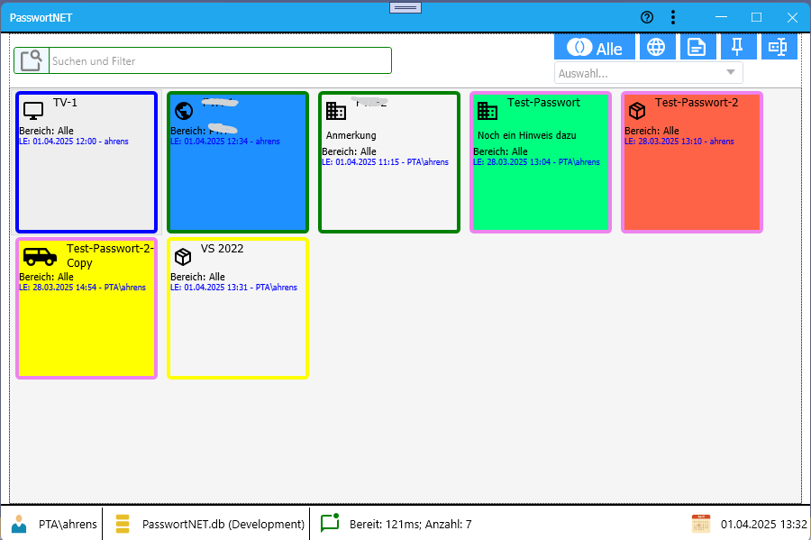

]

# PasswortNET
ist eine Verwaltungsprogramm für Passwörter, Pin, Lizenzen. Das Programm ist im Desing als **Single Page Application** erstellt. Die Daten selbst werden in einer [LiteDB](https://github.com/litedb-org/LiteDB) verschlüsselt gespeichert.
Das Programm verwendet das eigene [ModernUI Framework](https://github.com/GerhardAhrens/ModernUILibrary).

# Funktionen
- Verwalten von Webzugängen, Passwörtern, Pins, Lizenzen.
  Zu den einzelnen Einträgen können zusätzlich Anhänge und Bilder hinzugefügt werden
- Exportfunktionen nach Excel
- Backup der Datenbankdatei
- Syncronisieren von daten zwischen verschiedene PasswortNET Anwendungen
- Umfangreiche Filter- und Suchefunktionen

## Anmelden

## Hauptdialog

## Release Notes
 
- Erstellen der Basisfunktionen
- Dialog für Einstellungen

